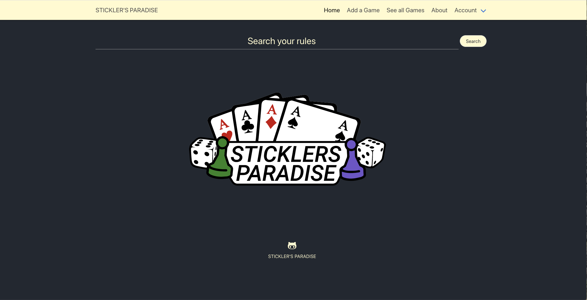
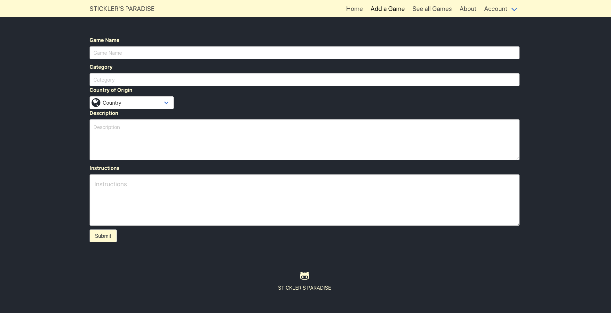
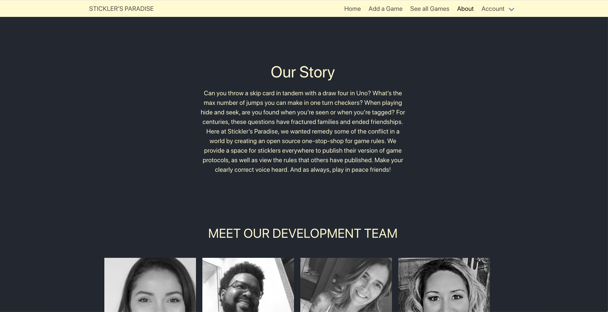
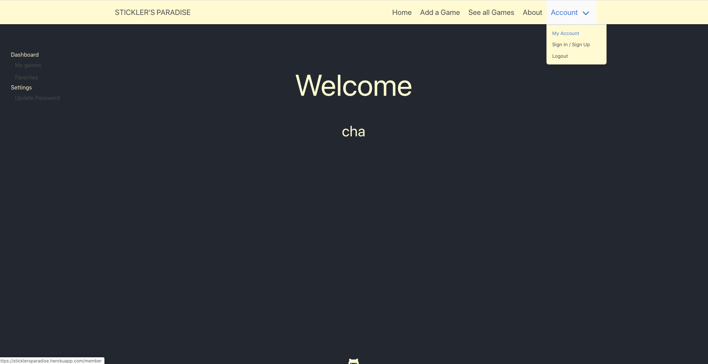
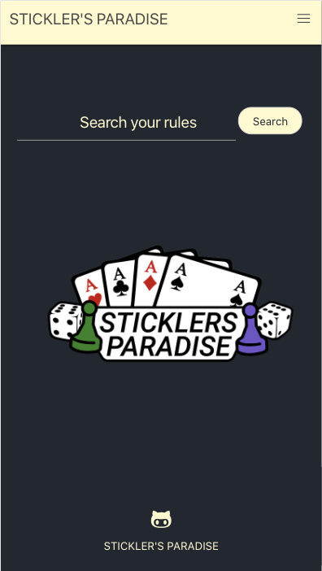
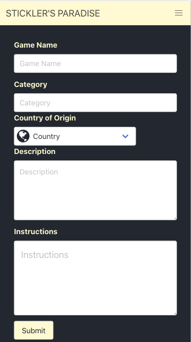
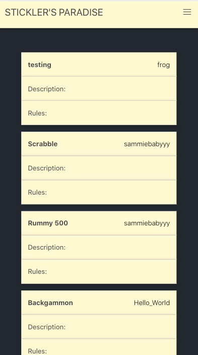
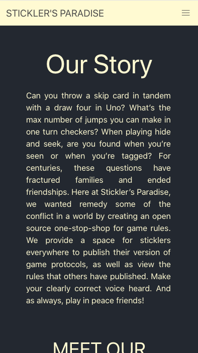
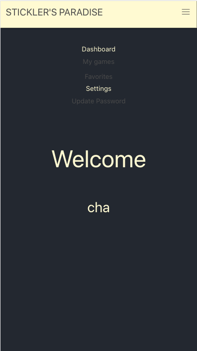

<h1 align= "center">Stickler's Paradise</h1> 
<h2>Live Link</h2>
<h3><a href= "https://sticklersparadise.herokuapp.com/">Live Link</a></h3>  
<h2> Table of Contents </h2>
<li><a href="#description">Description</a></li>  
<li><a href="#installation">Installation</a></li> 
<li><a href="#tech">Technology Stack</a></li> 
<li><a href="#usage">Usage</a></li> 
<li><a href="#screen">ScreenShots</a></li> 
<li><a href="#contributors">Contributors/ Contact</a></li>
<li><a href="#test">Test</a></li>

<h2 id="description"> Description </h2>
<p>An app that allows a user to access game rules at their fingertips. Stickler's Paradise is an open source app where a user can view and search for games, or they can create an account so that they can add in their own games and rules. When viewing games, the username is tagged to the game so that the author is known. Multiple versions of rules can be posted for games.
</p>

<h2 id="installation"> Installation </h2>
<p> Step 1. Git clone this link to your terminal: https://github.com/meanGirls01/rules</p>
<p> Step 2. Navigate into the cloned repository.</p>
<p> Step 3. Install the required dependencies using the following command:</p>

    ```
    npm install
    ```

<p> Step 4. Run the application from the command line with following command:</p>

    ```
    node server.js
    ```

<h2 id="tech"> Technology Stack </h2>          
<ul>
<li>HTML</li>
<li>CSS</li>
<li>Bulma</li>
<li>Materialize</li>
<li>JavaScript</li>
<li>JQuery</li>
<li>Node</li>
<li>Sequelize</li>
<li>MySQL</li>
<li>Express</li>
<li>Heroku</li>
<li>Git</li>
</ul>          
<h2 id="usage"> Usage </h2>
<p>Finding and adding game rules</p> 
<h2 id="screen"> ScreenShots </h2>
<h4> Desktop </h4>





<h4> Mobile </h4>





<h2 id="test"> Test </h2>

<h2 id="contributors"> Contributors/ Contact</h2>
<h4><a href= "https://github.com/chaalexander">@chaalexander</a></h4>

<h5><a href= "https://chaalexander.github.io/">Portfolio</a></h5>  
<h5><a href= "mailto:charlennep@gmail.com">charlennep@gmail.com</a></h5>       
<h5><a href= "https://www.linkedin.com/in/cha-alexander">LinkedIn</a></h5>
<hr>

<h4><a href= "https://github.com/jeverett93">@jeverett93</a></h4>

<h5><a href= "https://jeverett93.github.io/">Portfolio</a></h5>  
<h5><a href= "mailto:josheverett93@gmail.com">josheverett93@gmail.com</a></h5>       
<h5><a href= "https://www.linkedin.com/in/joshua-everett-087a4649/">LinkedIn</a></h5>
<hr>

<h4><a href= "https://github.com/sammiefrog">@sammiefrog</a></h4>

<h5><a href= "https://sammiefrog.github.io/">Portfolio</a></h5>  
<h5><a href= "mailto:ssasenick412@gmail.com">ssasenick412@gmail.com</a></h5>       
<h5><a href= "https://www.linkedin.com/in/sammantha-sasenick412/">LinkedIn</a></h5>
<hr>

<h4><a href= "https://github.com/git-theresa">@git-theresa</a></h4>

<h5><a href= "https://git-theresa.github.io/Portfolio/">Portfolio</a></h5>  
<h5><a href= "mailto:t.eatherly@gmail.com">t.eatherly@gmail.com</a></h5>       
<h5><a href= "https://www.linkedin.com/in/theresa-eatherly-4362b14a/">LinkedIn</a></h5>
